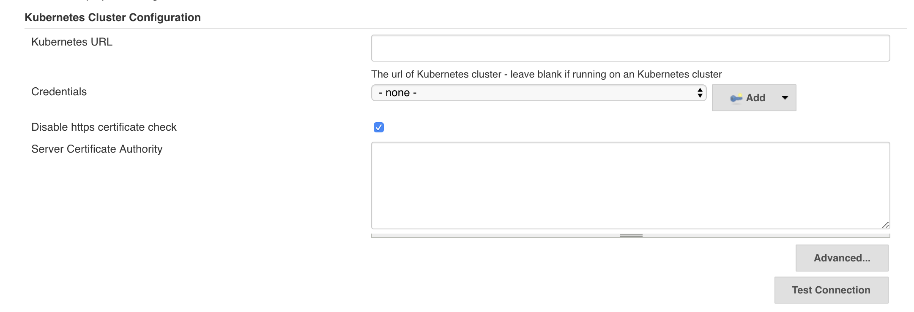

## Alauda Kubernetes Support Plugin

This plugin allows user to config kubernetes cluster and provide correspondent client for other plugins to use.

* Kubernetes URL - the address of Kubernetes Cluster, if left it to blank, it will use local cluster address.
* Credentials - the token to connect to cluster, the Credentials type is Secret Text. 
* Disable https certificate check - whether to skip tls verify
* Server Certificate Authority - certificate used to create secure connections to cluster
